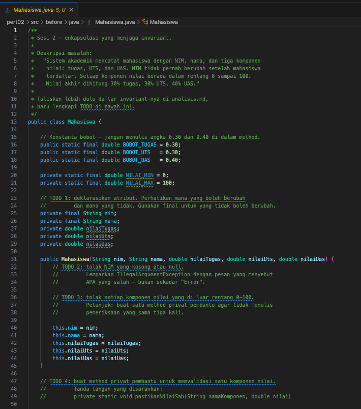
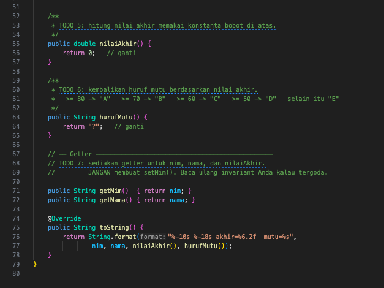
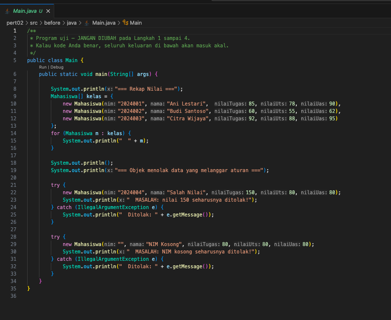
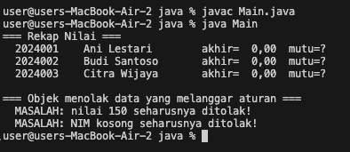
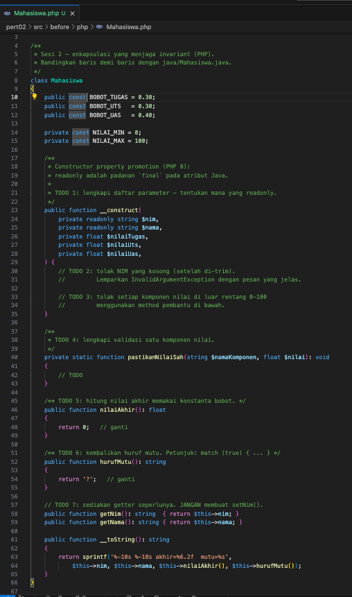
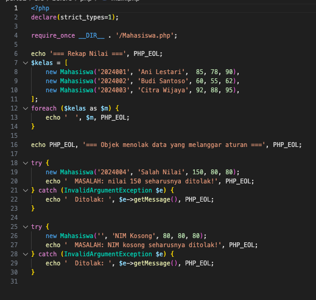
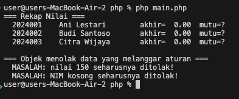
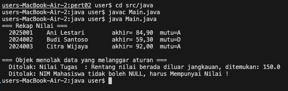
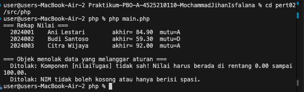

# **Pertemuan 02 - Praktikum Pemrograman Berorientasi Objek (PBO)**

## Biodata Mahasiswa
- **Nama**: Mochammad Jihan Isfalana  
- **NIM**: 4525210110  
- **Kelas**: Praktikum PBO A  

## Mata Kuliah dan Dosen
- **Mata Kuliah**: Pemrograman Berorientasi Objek  
- **Dosen Pengampu**: Adi Wahyu Pribadi, S.Si., M.Kom.  

---

## Tugas Pertemuan 02

### Deskripsi Tugas
Tugas pada pertemuan kedua adalah membuat program untuk mencatat data mahasiswa dengan konsep enkapsulasi, menjaga invariant, dan validasi nilai.

---

### Pengerjaan Tugas

#### Sebelum Pengerjaan
- Program belum memiliki validasi untuk NIM kosong dan nilai di luar rentang 0-100.
- Tidak ada mekanisme untuk menghitung nilai akhir dan huruf mutu.

#### Setelah Pengerjaan
- Validasi NIM dan nilai telah ditambahkan.
- Nilai akhir dihitung berdasarkan bobot tugas, UTS, dan UAS.
- Huruf mutu ditentukan berdasarkan nilai akhir.

#### Screenshot Pengerjaan
- **Screenshot Kode Mahasiswa.java Before**  
  
  ---
  

- **Screenshot Kode Main.java Before**  
  

- **Screenshot Hasil Running Program Java Before**  
  

---

- **Screenshot Kode Mahasiswa.php Before**  
  

- **Screenshot Kode main.php Before**  
  

- **Screenshot Hasil Running Program Php Before**  
  

---

- **Screenshot Hasil Running Program Java After**  
  

---

- **Screenshot Hasil Running Program Php After**  
  

---

## Kesimpulan
Melalui tugas ini, mahasiswa memahami konsep enkapsulasi, validasi data, dan menjaga invariant dalam program berbasis Java. Mahasiswa juga belajar menerapkan logika untuk menghitung nilai akhir dan huruf mutu secara dinamis.

---

Dokumen ini dibuat sebagai bagian dari tugas Praktikum PBO A. &copy; Milik Mochammad Jihan Isfalana - 4525210110
