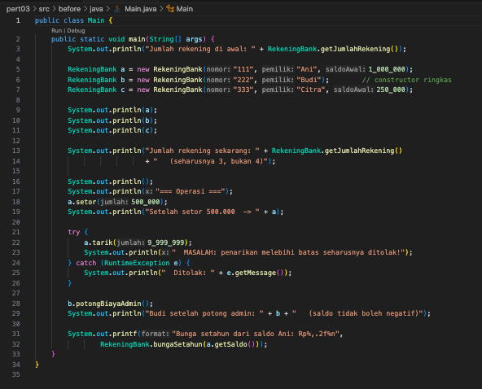
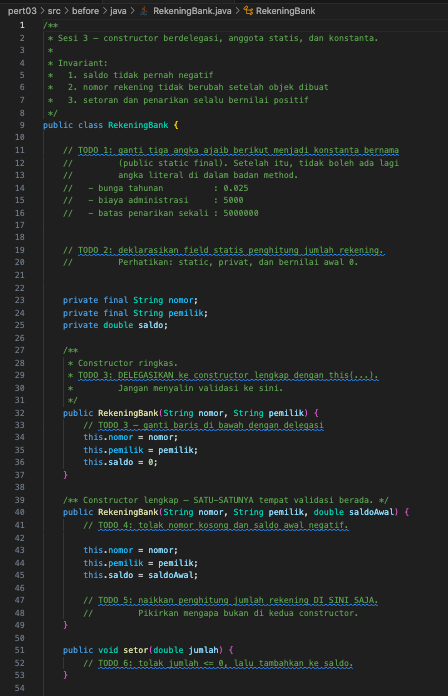
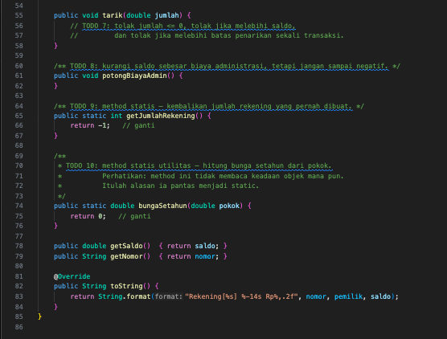
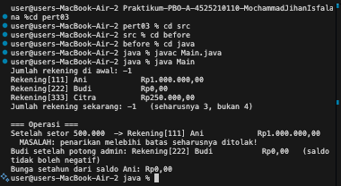
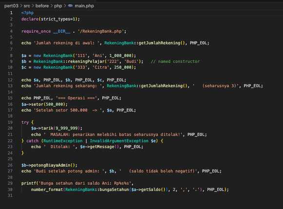
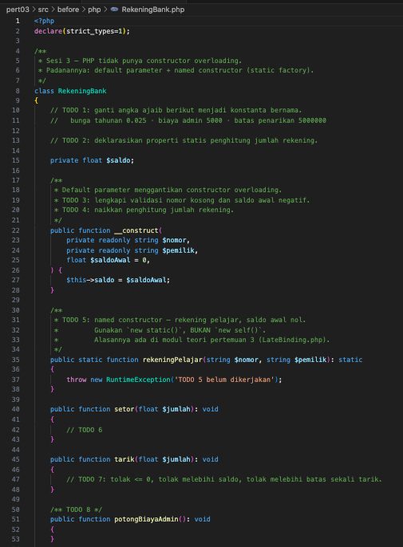
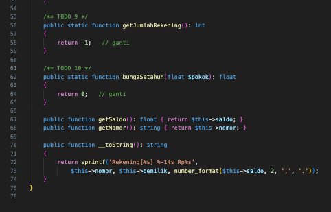
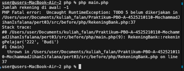

# **Pertemuan 03 - Praktikum Pemrograman Berorientasi Objek (PBO)**

## Biodata Mahasiswa
- **Nama**: Mochammad Jihan Isfalana  
- **NIM**: 4525210110  
- **Kelas**: Praktikum PBO A  

## Mata Kuliah dan Dosen
- **Mata Kuliah**: Prak. Pemrograman Berorientasi Objek  
- **Dosen Pengampu**: Adi Wahyu Pribadi, S.Si., M.Kom.  

---

## Tugas Pertemuan 03

### Deskripsi Tugas
Tugas pada pertemuan ketiga adalah membuat program rekening bank menggunakan Java dan PHP dengan materi meliputi constructor, static, konstanta, dan validasi.

---

### Pengerjaan Tugas

#### Sebelum Pengerjaan
- Program belum memiliki validasi untuk nomor rekening kosong dan saldo awal negatif.
- Tidak ada konstanta untuk angka ajaib seperti bunga tahunan, biaya administrasi, dan batas penarikan.
- Tidak ada penghitung jumlah rekening yang dibuat.

#### Setelah Pengerjaan
- Validasi nomor rekening dan saldo awal telah ditambahkan.
- Angka ajaib diganti dengan konstanta bernama.
- Penghitung jumlah rekening ditambahkan menggunakan atribut static.

#### Screenshot Pengerjaan
- **Screenshot Kode Main.java Before**  
  

- **Screenshot Kode RekeningBank.java Before**  
  
  ---
  

- **Screenshot Hasil Running Program Java Before**  
  

- **Screenshot Kode Main.php Before**  
  

- **Screenshot Kode RekeningBank.php Before**  
  

  ---

  

- **Screenshot Hasil Running Program PHP Before**  
  

---

- **Screenshot Kode Main.java After**  
  .png)

- **Screenshot Kode RekeningBank.java After**  
  .png)
  ---
  .png)

- **Screenshot Hasil Running Program Java After**  
  .png)

- **Screenshot Kode Main.php After**  
  .png)

- **Screenshot Kode RekeningBank.php After**  
  .png)

- **Screenshot Hasil Running Program PHP After**  
  .png)

---

## Kesimpulan
Melalui tugas ini, mahasiswa memahami penggunaan constructor, static, konstanta, dan validasi dalam program berbasis Java dan PHP. Mahasiswa juga belajar menerapkan logika untuk menjaga invariant dan meningkatkan kualitas kode dengan mengganti angka ajaib menggunakan konstanta.

---

Dokumen ini dibuat sebagai bagian dari tugas Praktikum PBO A. &copy; Milik Mochammad Jihan Isfalana - 4525210110