# **Pertemuan 04 - Praktikum Pemrograman Berorientasi Objek (PBO)**

## Biodata Mahasiswa
- **Nama**: Mochammad Jihan Isfalana  
- **NIM**: 4525210110  
- **Kelas**: Praktikum PBO A  

## Mata Kuliah dan Dosen
- **Mata Kuliah**: Prak. Pemrograman Berorientasi Objek  
- **Dosen Pengampu**: Adi Wahyu Pribadi, S.Si., M.Kom.  

---

## Tugas Pertemuan 04

Materi pertemuan ini adalah **Inheritance (Pewarisan)** dengan studi kasus hierarki **Pegawai** yang diimplementasikan dalam **Java** dan **PHP**. Tugas yang dikerjakan:

1. Melengkapi kelas induk `Pegawai`: validasi gaji pokok tidak boleh negatif dan `hitungGaji()` mengembalikan gaji pokok.
2. Melengkapi `PegawaiTetap`: gaji = gaji dasar induk (`super`/`parent`) + tunjangan masa kerja (2% per tahun, maksimum 40%).
3. Menentukan apakah `hitungGaji()` perlu di-override pada `PegawaiKontrak` (alasan dicatat di `catatan.md`).
4. Membuat kelas turunan baru `Dosen` dan `PegawaiHarian`, lalu menambahkannya ke daftar di `Main`.

---

## Pengerjaan Tugas, Penjelasan, dan Hasil

### 1. Kondisi Sebelum (Starter Code)

Kode awal baru memuat kelas `Pegawai`, `PegawaiTetap`, dan `PegawaiKontrak` dengan beberapa bagian `TODO` yang belum dikerjakan. Kelas `Dosen` dan `PegawaiHarian` belum ada.

**Hasil Running Java (Sebelum)**

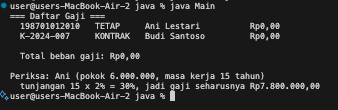

**Hasil Running PHP (Sebelum)**

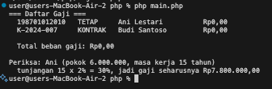

### 2. Kondisi Sesudah (Implementasi)

#### Java

| File | Penjelasan |
|------|------------|
| `Pegawai.java` | Kelas abstract induk. Menolak gaji pokok negatif lewat `IllegalArgumentException`, `hitungGaji()` mengembalikan `gajiPokok`, dan `jenis()` bersifat abstract. |
| `PegawaiTetap.java` | Memanggil `super(...)` di konstruktor. `hitungGaji()` memakai `super.hitungGaji()` lalu menambah tunjangan masa kerja (2% per tahun, maks. 40%). |
| `PegawaiKontrak.java` | Gaji sebatas gaji pokok tanpa tunjangan, menyimpan `bulanKontrak`. |
| `PegawaiHarian.java` | Gaji = `upahPerJam` x `jamKerja`. |
| `Dosen.java` | Turunan `PegawaiTetap` dengan atribut tambahan `bidangKeahlian`. |
| `Main.java` | Membuat array `Pegawai[]` berisi semua jenis pegawai, menampilkan daftar gaji dan total beban gaji (polimorfisme). |

**Pegawai.java**

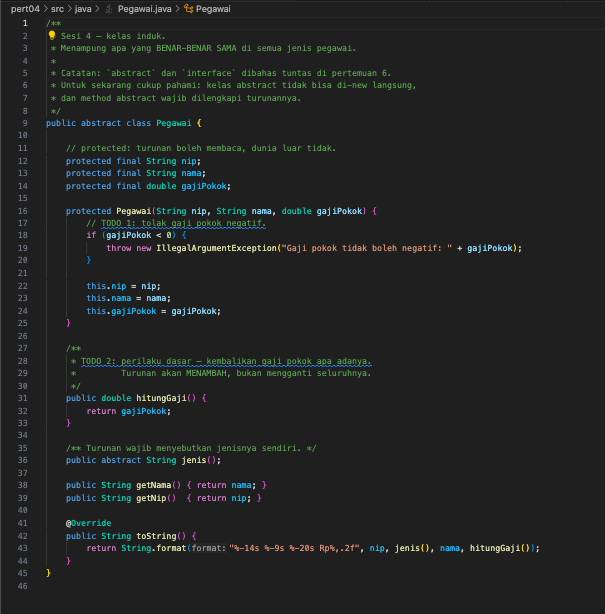

**PegawaiTetap.java**

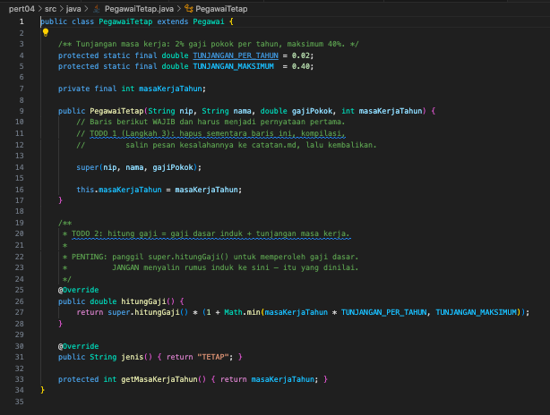

**PegawaiKontrak.java**

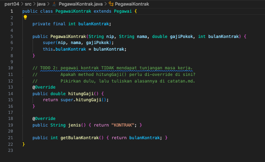

**PegawaiHarian.java**

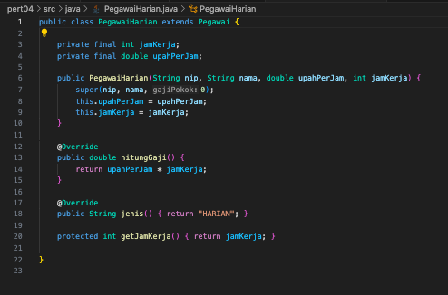

**Dosen.java**

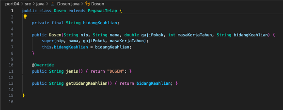

**Main.java**

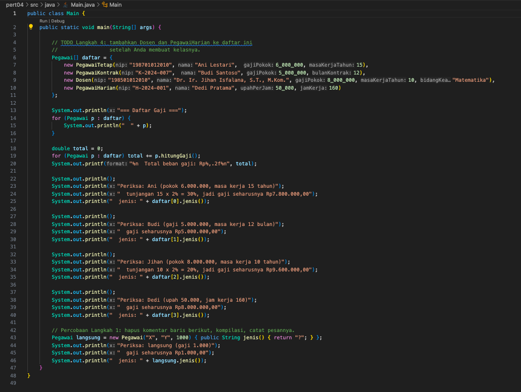

**Hasil Running Java (Sesudah)**

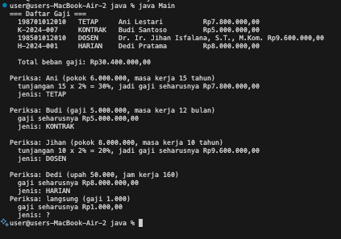

#### PHP

Seluruh hierarki ditulis dalam satu berkas `Pegawai.php`, sedangkan `main.php` berisi pengujiannya.

| Kelas | Penjelasan |
|-------|------------|
| `Pegawai` | Kelas abstract dengan constructor promotion, validasi gaji negatif (`InvalidArgumentException`), dan `__toString()`. |
| `PegawaiTetap` | `parent::hitungGaji()` + tunjangan masa kerja (2% per tahun, maks. 40%). |
| `PegawaiKontrak` | Hanya gaji pokok, menyimpan `bulanKontrak`. |
| `Dosen` | Turunan `PegawaiTetap` dengan tunjangan fungsional tetap Rp1.000.000 (jika `punyaTunjanganFungsional = true`). |
| `PegawaiHarian` | Gaji = `gajiPokok` x `hariKerja`. |

**Pegawai.php (Pegawai dan PegawaiTetap)**

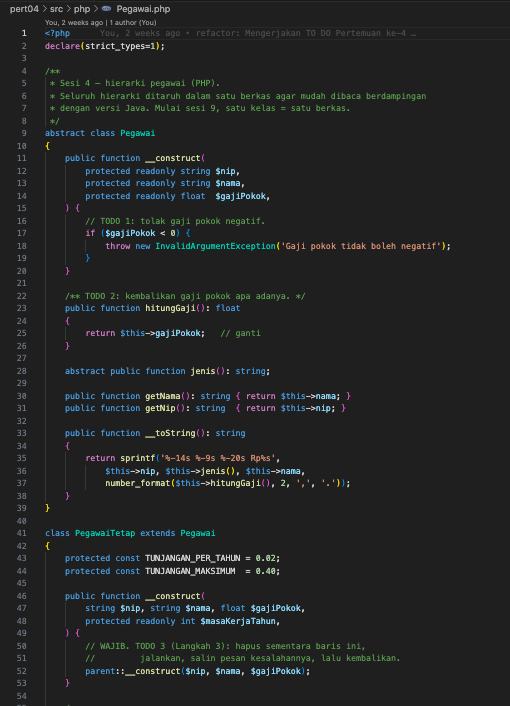

**Pegawai.php (PegawaiKontrak dan Dosen)**

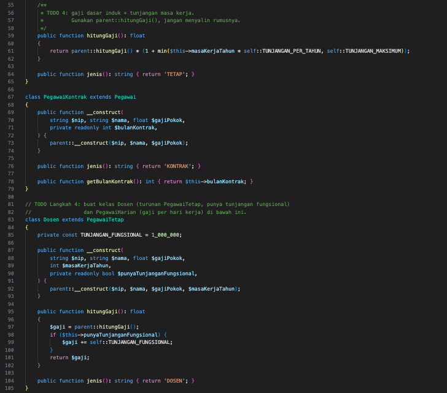

**Pegawai.php (PegawaiHarian)**

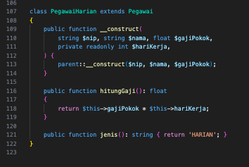

**main.php**

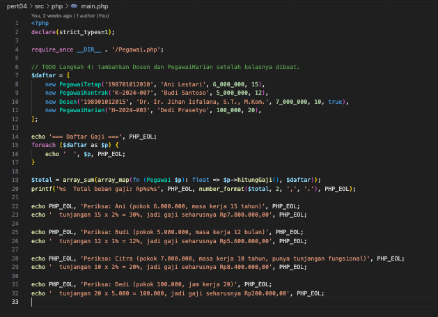

**Hasil Running PHP (Sesudah)**

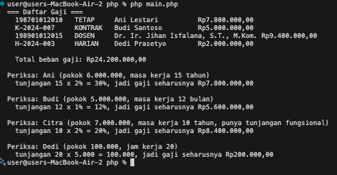

## Kesimpulan

Melalui tugas pertemuan keempat ini, mahasiswa diharapkan mampu memahami konsep inheritance, penggunaan `super`/`parent` untuk memakai kembali logika kelas induk tanpa menyalin rumus, overriding method, serta polimorfisme pada hierarki kelas di Java dan PHP.

---

Dokumen ini dibuat sebagai bagian dari tugas Praktikum PBO A. &copy; Milik Mochammad Jihan Isfalana - 4525210110