# LAPORAN PRAKTIKUM PBO A - PERTEMUAN 5

- **Nama :** Mochammad Jihan Isfalana
- **NPM :** 4525210110
- **Mata Kuliah :** Praktikum Pemrograman Berorientasi Objek

## Materi

## `Pegawai Menggunakan Java & PHP`

`Materi : Inheritance (Pewarisan)`

---

## **Java Programming Language**

---

## Screenshot Coding Main.java

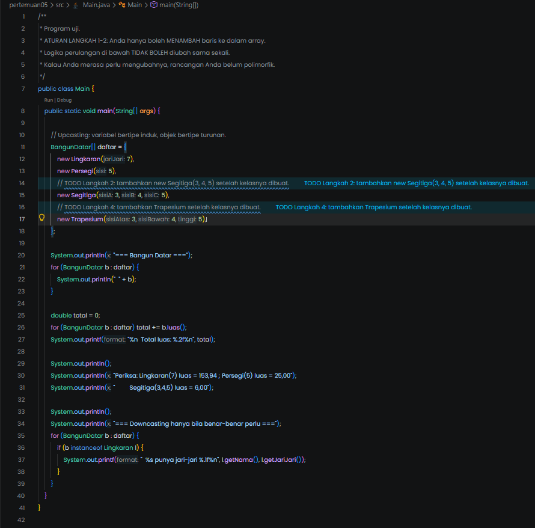

## Screenshot Hasil Main.java

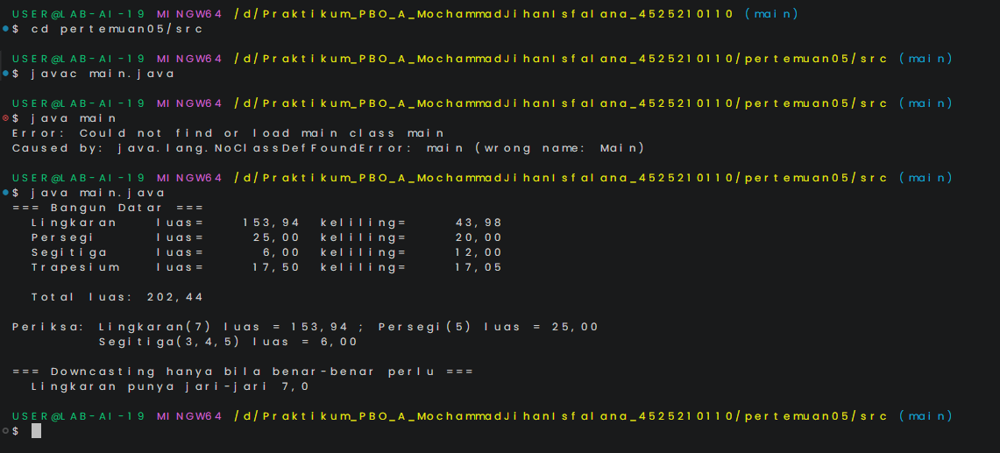

## Screenshot Coding Segitiga.java

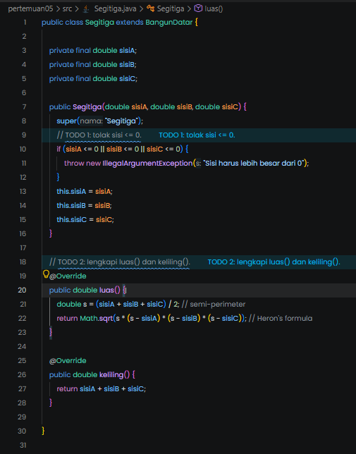

## Screenshot Coding Trapesium.java

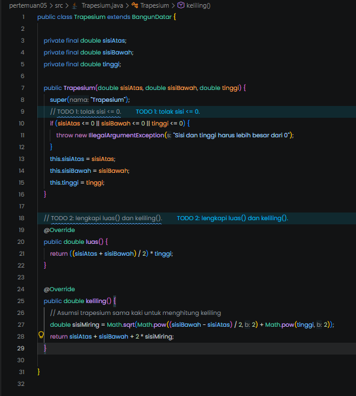

## Screenshot Coding Lingkaran.java

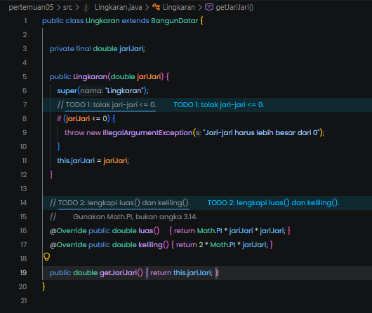

## Screenshot Coding Persegi.java

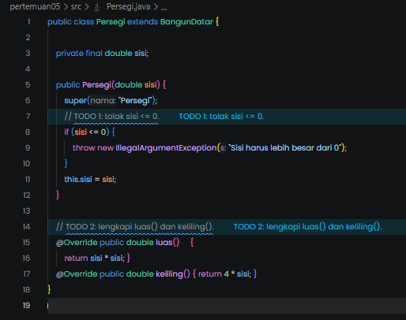

## Screenshot Coding AntiPattern.java

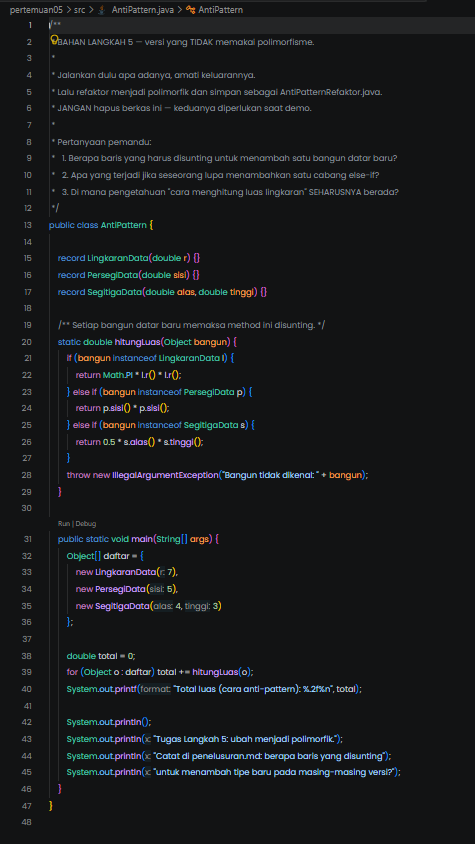

## Screenshot Coding BangunDatar.java

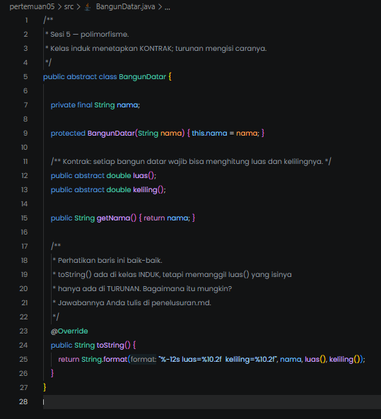

---

## **PHP Programming Language**

---

## Screenshot Coding BangunDatar.php

## 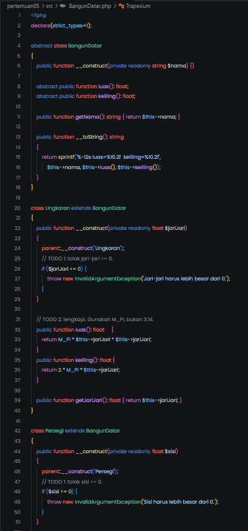

## 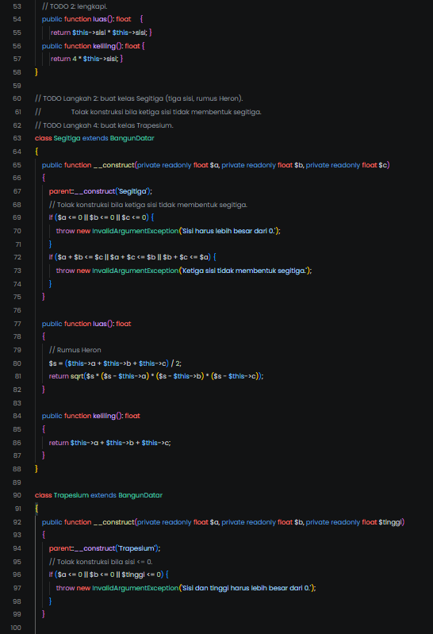

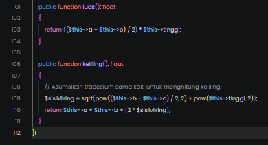

## Screenshot Coding notifikasi.php

## 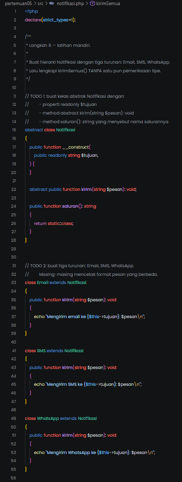

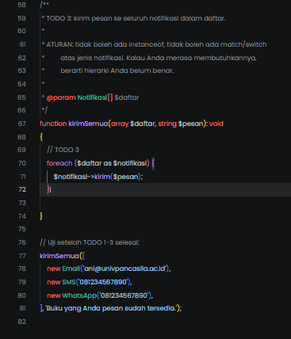

## Screenshot Coding main_php.php

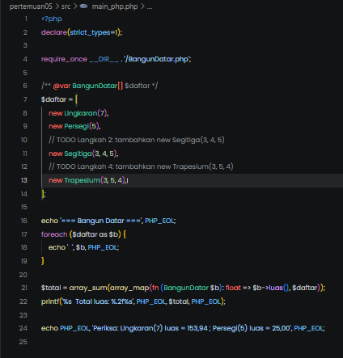

## Screenshot Hasil main_php.php

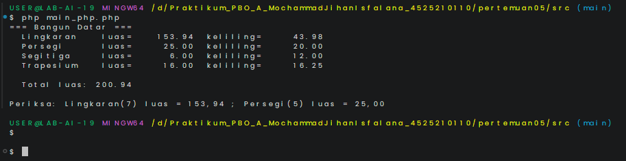
