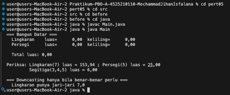
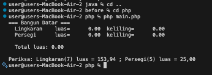
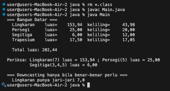
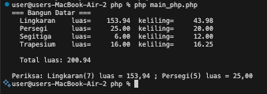
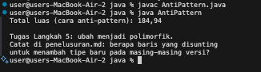
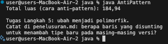

# **Pertemuan 05 - Praktikum Pemrograman Berorientasi Objek (PBO)**

## Biodata Mahasiswa
- **Nama**: Mochammad Jihan Isfalana  
- **NIM**: 4525210110  
- **Kelas**: Praktikum PBO A  

## Mata Kuliah dan Dosen
- **Mata Kuliah**: Pemrograman Berorientasi Objek  
- **Dosen Pengampu**: Adi Wahyu Pribadi, S.Si., M.Kom.  

---

## Tugas Pertemuan 05

**Materi**: Polimorfisme (*Polymorphism*) pada Java dan PHP.

Tugas yang dikerjakan:

1. Melengkapi hierarki `BangunDatar` di Java: `Lingkaran`, `Persegi`, `Segitiga` (rumus Heron), dan `Trapesium`, tanpa mengubah logika perulangan di `Main`.
2. Mengimplementasikan hierarki yang sama di PHP.
3. Membandingkan kode **anti-pattern** (`if`/`else-if` dengan `instanceof`) dengan versi refaktor yang polimorfik.
4. Membuat hierarki `Notifikasi` (`Email`, `SMS`, `WhatsApp`) di PHP, lalu mengirim pesan ke semuanya tanpa `instanceof`, `match`, atau `switch` atas jenis notifikasi.
5. Menjawab pertanyaan penelusuran pada [penelusuran.md](./penelusuran.md).

---

## Pengerjaan Tugas, Penjelasan, dan Hasil

### 1. Kondisi Sebelum (Starter Code)

Kode awal tersimpan di `src/before/java` dan `src/before/php`. Kelas turunan masih berisi `TODO` (validasi input, `luas()`, dan `keliling()`), kelas `Segitiga` dan `Trapesium` belum ada, serta daftar objek di `Main` belum lengkap.

**Hasil Running Java (Sebelum)**

**Hasil Running PHP (Sebelum)**

### 2. Kondisi Sesudah (Implementasi)

#### Java (`src/java`)

| File | Penjelasan |
|------|------------|
| `BangunDatar.java` | Kelas abstract induk. Menetapkan kontrak `luas()` dan `keliling()`, serta `toString()` yang memanggil keduanya. |
| `Lingkaran.java` | Menolak jari-jari <= 0. Memakai `Math.PI`. Menyediakan `getJariJari()` untuk downcasting. |
| `Persegi.java` | Menolak sisi <= 0. Luas = sisi x sisi, keliling = 4 x sisi. |
| `Segitiga.java` | Tiga sisi, luas dengan rumus Heron, keliling = jumlah ketiga sisi. |
| `Trapesium.java` | Luas = (sisi atas + sisi bawah) / 2 x tinggi. Keliling dihitung dengan asumsi trapesium sama kaki. |
| `Main.java` | Array `BangunDatar[]` (upcasting), perulangan `toString()` dan total luas, serta downcasting dengan `instanceof` khusus `Lingkaran`. |

**BangunDatar.java**

**Lingkaran.java**

**Persegi.java**

**Segitiga.java**

**Trapesium.java**

**Main.java**

**Hasil Running Java (Sesudah)**

#### PHP (`src/php`)

Seluruh hierarki `BangunDatar` ditulis dalam satu berkas, sedangkan `main.php` berisi pengujiannya.

| Kelas | Penjelasan |
|-------|------------|
| `BangunDatar` | Kelas abstract dengan `luas()`, `keliling()` abstract, dan `__toString()`. |
| `Lingkaran` | Memakai `M_PI` dan melempar `InvalidArgumentException` bila jari-jari <= 0. |
| `Persegi` | Validasi sisi > 0, luas dan keliling persegi. |
| `Segitiga` | Rumus Heron. Menolak sisi <= 0 dan sisi yang tidak memenuhi pertidaksamaan segitiga. |
| `Trapesium` | Luas trapesium, keliling dengan asumsi sama kaki. |

**BangunDatar.php**

**main.php**

**Hasil Running PHP (Sesudah)**

### 3. Anti-Pattern vs Polimorfisme (Java)

`AntiPattern.java` menghitung luas dengan satu method `hitungLuas(Object)` yang berisi rantai `instanceof`. Setiap bangun datar baru memaksa method ini disunting, dan bila satu cabang `else-if` terlupa, kesalahan baru muncul saat program berjalan (`IllegalArgumentException`). Pada versi refaktor (`AntiPatternRefaktor.java`), pengetahuan cara menghitung luas dipindahkan ke masing-masing kelas bangun datar, sehingga bangun baru cukup ditambahkan sebagai kelas baru tanpa menyunting logika yang sudah ada.

**Kode AntiPattern.java**

**Hasil Running Anti-Pattern (Sebelum)**

**Hasil Running Anti-Pattern (Sesudah Refaktor)**

### 4. Latihan Mandiri: Notifikasi (PHP)

`notifikasi.php` berisi kelas abstract `Notifikasi` (properti `readonly $tujuan`, method abstract `kirim()`, dan `saluran()`) dengan tiga turunan: `Email`, `SMS`, dan `WhatsApp`, yang masing-masing mencetak format pesan berbeda. Fungsi `kirimSemua()` cukup memanggil `kirim()` pada setiap objek tanpa pemeriksaan tipe sama sekali.

### 5. Penelusuran

Pertanyaan: bagaimana `toString()` di kelas induk dapat memanggil `luas()` dan `keliling()` yang implementasinya hanya ada di kelas turunan? Jawabannya adalah **dynamic binding**: kelas induk menetapkan kontrak lewat method `abstract`, dan JVM memilih implementasi sesuai objek konkret saat program berjalan. Jawaban lengkap ada di [penelusuran.md](./penelusuran.md).

---

## Kesimpulan

Melalui tugas pertemuan kelima ini, mahasiswa diharapkan mampu memahami polimorfisme: satu referensi bertipe induk dapat memanggil perilaku yang berbeda sesuai objek turunannya. Dengan pendekatan ini, tipe baru dapat ditambahkan tanpa menyunting logika yang sudah ada, berbeda dengan pendekatan anti-pattern berbasis `instanceof`.

---

Dokumen ini dibuat sebagai bagian dari tugas Praktikum PBO A. &copy; Milik Mochammad Jihan Isfalana - 4525210110