# **Pertemuan 06 - Praktikum Pemrograman Berorientasi Objek (PBO)**

## Biodata Mahasiswa
- **Nama**: Mochammad Jihan Isfalana  
- **NIM**: 4525210110  
- **Kelas**: Praktikum PBO A  

## Mata Kuliah dan Dosen
- **Mata Kuliah**: Pemrograman Berorientasi Objek  
- **Dosen Pengampu**: Adi Wahyu Pribadi, S.Si., M.Kom.  

---

## Tugas Pertemuan 06

**Materi**: Abstraksi (*Abstract Class*, *Interface*, *Enum*, dan *Trait*) pada Java dan PHP, dengan studi kasus hierarki **Kendaraan**.

Tugas yang dikerjakan:

1. Melengkapi interface `Movable` (termasuk *default method* `ringkasanGerak()`) dan `Fuelable`, yang sengaja dipisah (*Interface Segregation Principle*).
2. Melengkapi abstract class `Kendaraan` dan kelas `Mobil` (`extends Kendaraan implements Movable, Fuelable`), lalu membuat kelas `Sepeda` yang hanya `Movable`, bukan `Fuelable`.
3. Melengkapi enum `TipeBahanBakar` (`BENSIN`, `SOLAR`, `LISTRIK`) beserta perilakunya.
4. Mencoba `isiPenuh(sepeda)`, mencatat pesan kesalahannya, dan menjelaskan mengapa penolakan saat kompilasi menguntungkan pada [keputusan.md](./src/keputusan.md).
5. PHP: memakai *trait* `Loggable` pada `Mobil` dan kelas `Pesanan` yang tidak sekerabat dengan `Kendaraan`.

---

## Pengerjaan Tugas, Penjelasan, dan Hasil

### 1. Kondisi Sebelum (Starter Code)

Kode awal tersimpan di `src/before/java` dan `src/before/php`. Bagian `TODO` masih kosong (`umur()`, `Mobil`, default method `Movable`, enum `TipeBahanBakar`, trait `Loggable`), konstanta `LISTRIK` belum ada, serta kelas `Sepeda` dan `Pesanan` belum dibuat.

#### Java

**Movable.java**

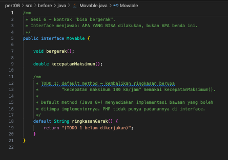

**Fuelable.java**

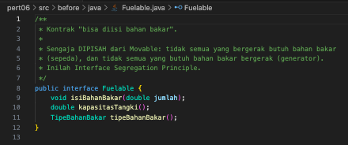

**Kendaraan.java**

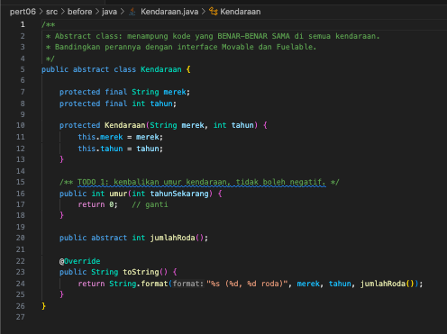

**Mobil.java**

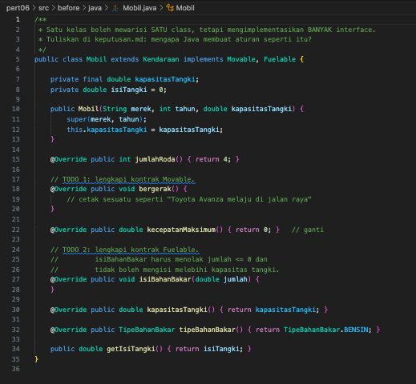

**TipeBahanBakar.java**

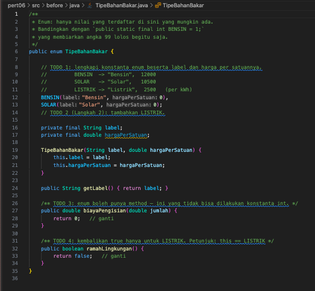

**Main.java**

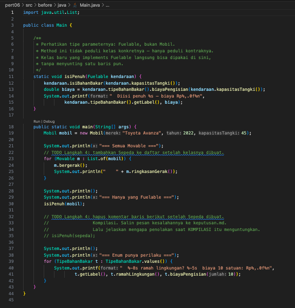

#### PHP

**abstraksi.php**

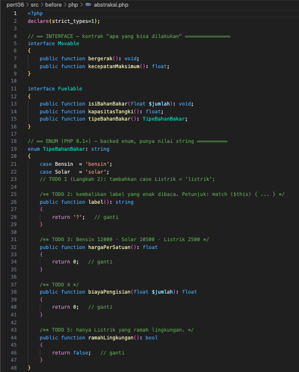
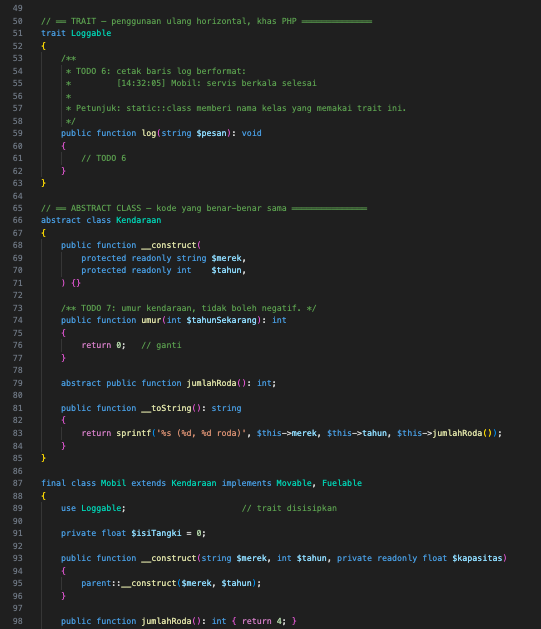
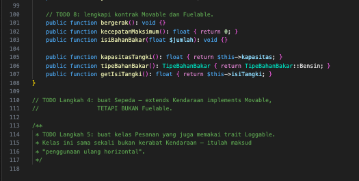

**main.php**

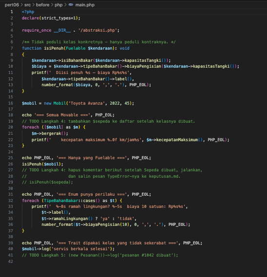

### 2. Kondisi Sesudah (Implementasi)

#### Java

| File | Penjelasan |
|------|------------|
| `Movable.java` | Interface kontrak "bisa bergerak": `bergerak()`, `kecepatanMaksimum()`, dan *default method* `ringkasanGerak()` yang memakai `kecepatanMaksimum()`. |
| `Fuelable.java` | Interface kontrak "bisa diisi bahan bakar", dipisah dari `Movable` karena tidak semua yang bergerak butuh bahan bakar (sepeda). |
| `Kendaraan.java` | Abstract class berisi kode yang sama di semua kendaraan: `merek`, `tahun`, `umur()` (tidak pernah negatif), dan `jumlahRoda()` abstract. |
| `Mobil.java` | Mewarisi satu class dan mengimplementasikan dua interface. `isiBahanBakar()` menolak jumlah <= 0 dan pengisian melebihi kapasitas tangki. |
| `Sepeda.java` | `extends Kendaraan implements Movable` saja, 2 roda, kecepatan maksimum 25 km/jam. Tidak `Fuelable`. |
| `TipeBahanBakar.java` | Enum dengan label dan harga per satuan, method `biayaPengisian()`, dan `ramahLingkungan()` (hanya `LISTRIK`). |
| `Main.java` | `isiPenuh(Fuelable)` hanya bergantung pada kontrak, perulangan atas `Movable`, dan demonstrasi perilaku enum. |

**Movable.java**

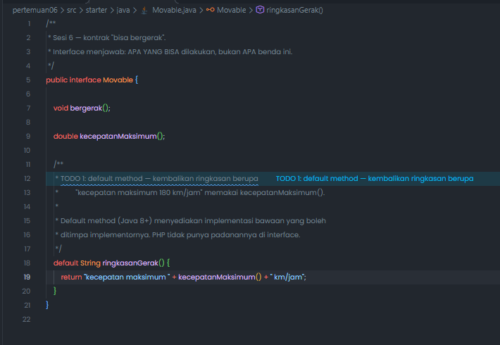

**Fuelable.java**

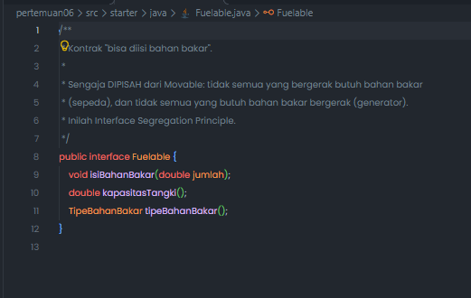

**Kendaraan.java**

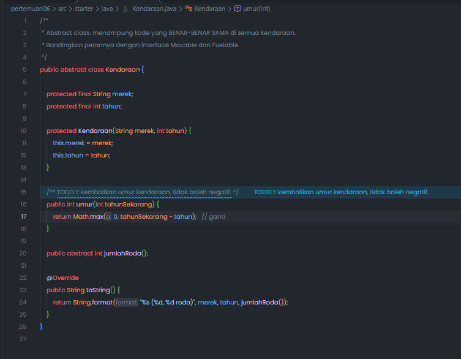

**Mobil.java**

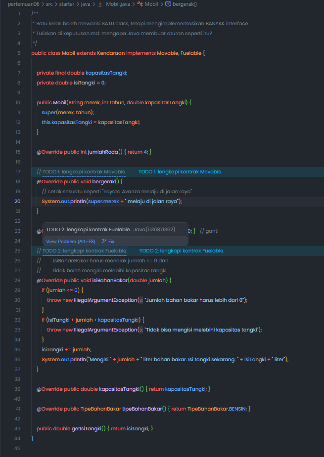

**Sepeda.java**

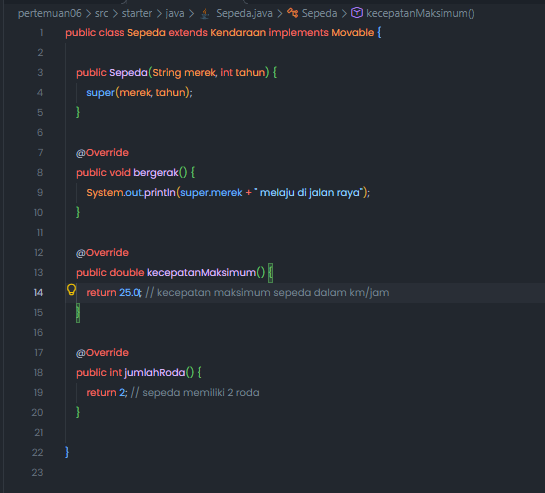

**TipeBahanBakar.java**

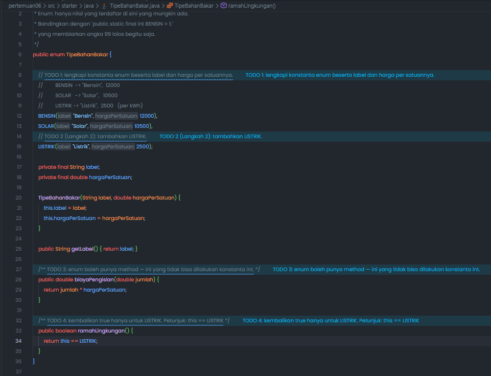

**Main.java**

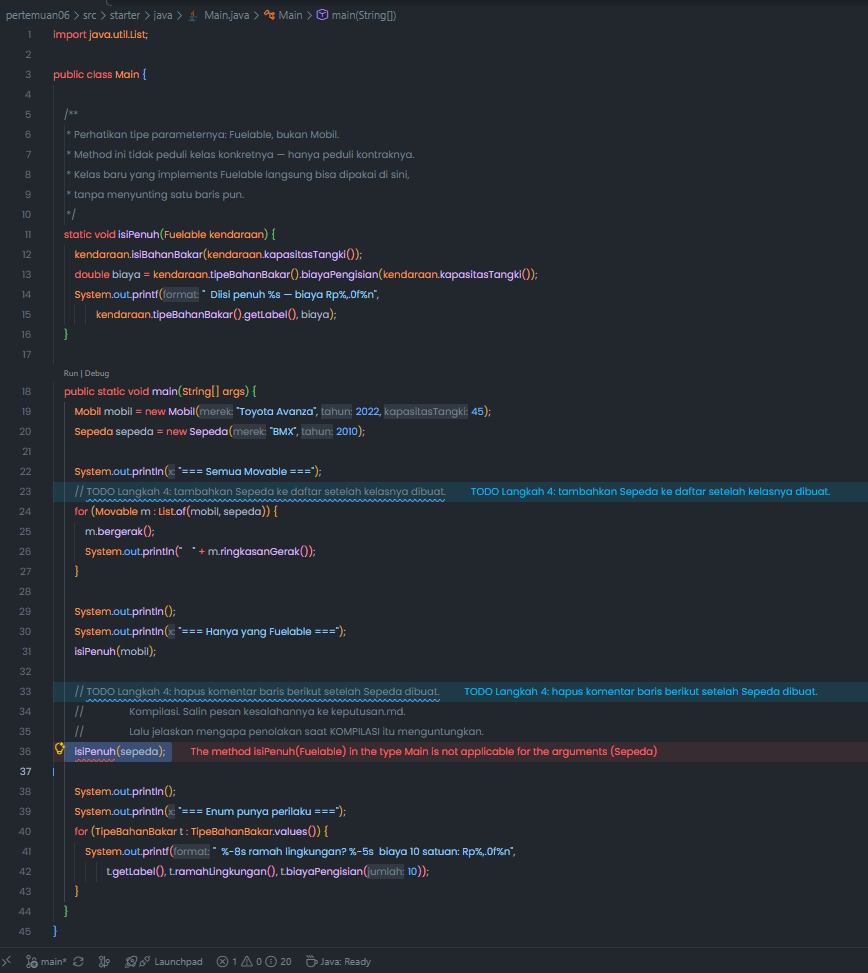
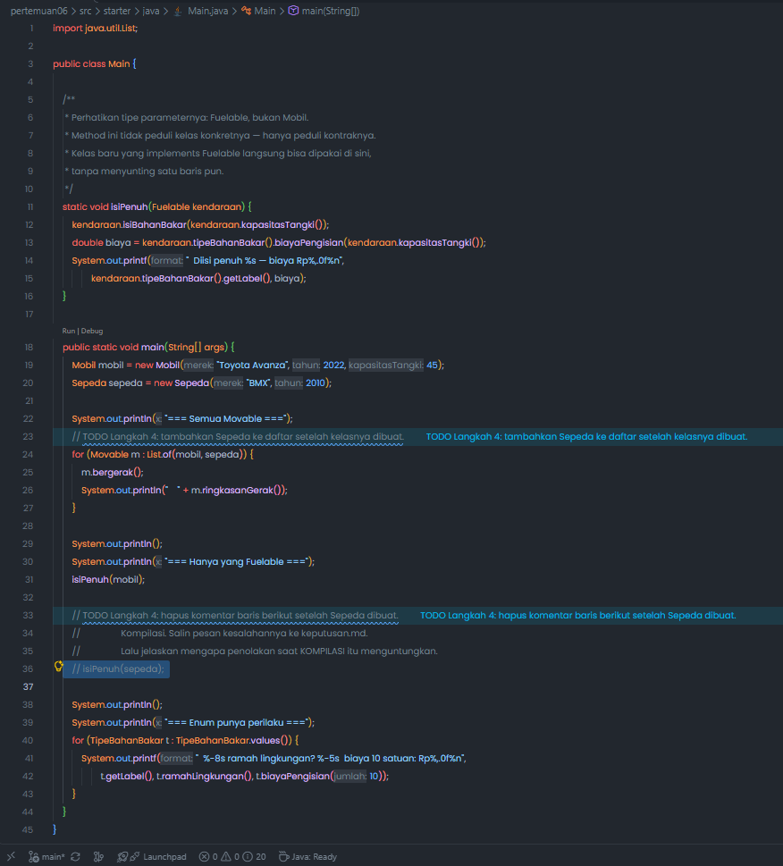

**Hasil Running Java**

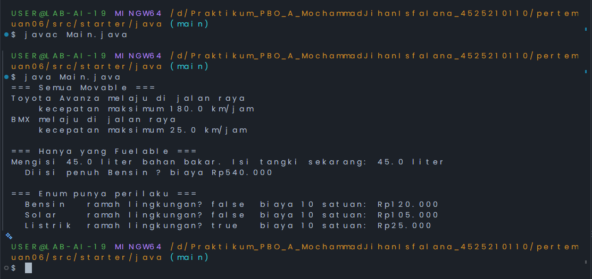

**Percobaan `isiPenuh(sepeda)`: ditolak saat kompilasi**

Baris `isiPenuh(sepeda)` diaktifkan sementara untuk dicoba, lalu dikomentari kembali agar program tetap bisa dikompilasi.

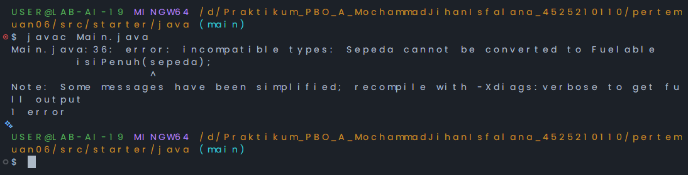

#### PHP

Seluruh kontrak dan kelas ditulis dalam `abstraksi.php`, sedangkan `main.php` berisi pengujiannya.

| Komponen | Penjelasan |
|----------|------------|
| `Movable`, `Fuelable` | Interface kontrak. Interface PHP tidak punya *default method* seperti Java. |
| `TipeBahanBakar` | *Backed enum* (`string`) dengan case `Bensin`, `Solar`, `Listrik`, memakai `match` untuk label dan harga. |
| `Loggable` | *Trait* dengan `log()` yang mencetak `[jam] NamaKelas: pesan` memakai `static::class`. |
| `Kendaraan` | Abstract class dengan `umur()` dan `jumlahRoda()` abstract. |
| `Mobil` | `final`, `extends Kendaraan implements Movable, Fuelable`, memakai trait `Loggable`. |
| `Sepeda` | `extends Kendaraan implements Movable`, bukan `Fuelable`. |
| `Pesanan` | Memakai trait `Loggable` walau tidak sekerabat dengan `Kendaraan` (penggunaan ulang horizontal). |

**abstraksi.php**

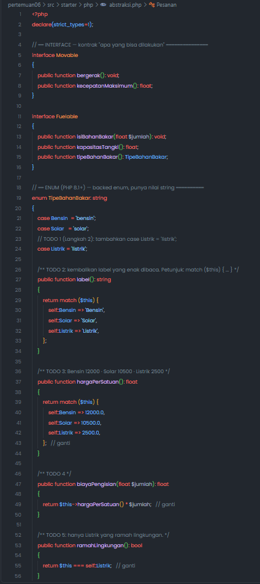
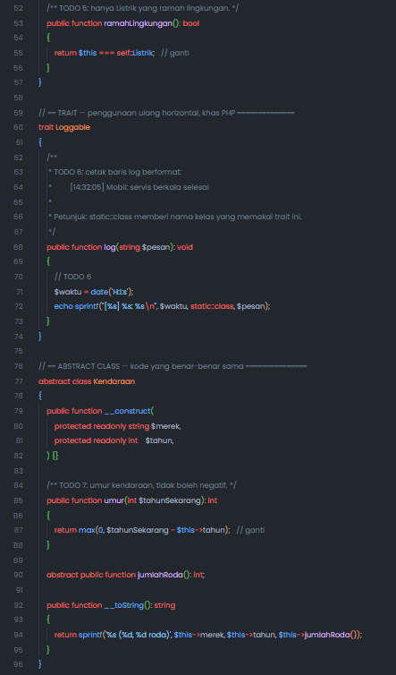
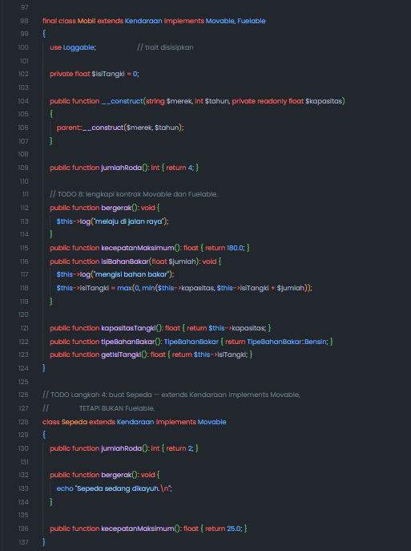
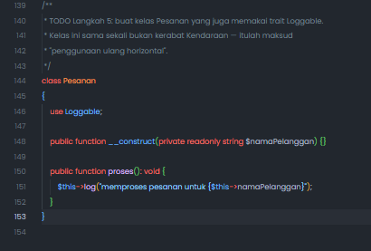

**main.php**

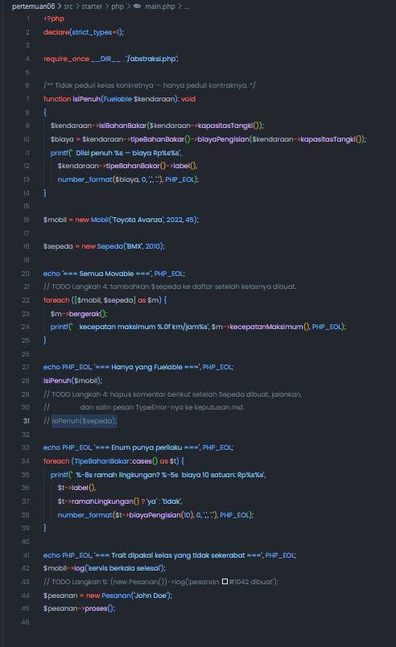

**Hasil Running PHP**

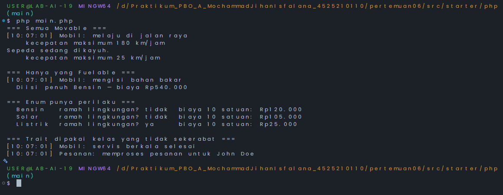

**Percobaan `isiPenuh($sepeda)`: ditolak saat dijalankan (`TypeError`)**

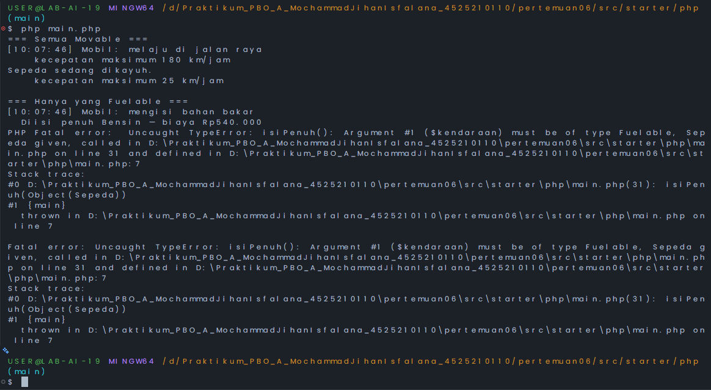

### 3. Keputusan: Mengapa Penolakan Saat Kompilasi Menguntungkan?

Catatan lengkap beserta output error Java dan PHP ada di [keputusan.md](./src/keputusan.md). Intinya, penolakan di awal menangkap kesalahan tipe sebelum program berjalan (*type safety*), mencegah crash di lingkungan produksi, dan memberi umpan balik cepat tentang batas kemampuan suatu objek tanpa perlu pengujian manual.

---

## Kesimpulan

Melalui tugas pertemuan keenam ini, mahasiswa diharapkan mampu memahami abstraksi: *abstract class* untuk kode yang benar-benar sama, *interface* untuk kontrak "apa yang bisa dilakukan", *enum* untuk himpunan nilai tetap yang punya perilaku, dan *trait* (PHP) untuk penggunaan ulang kode lintas hierarki. Percobaan `isiPenuh(sepeda)` juga menunjukkan perbedaan kedua bahasa: Java menolaknya saat **kompilasi**, sedangkan PHP baru menolaknya saat **dijalankan** lewat `TypeError`, setelah sebagian program sempat berjalan.

---

Dokumen ini dibuat sebagai bagian dari tugas Praktikum PBO A. &copy; Milik Mochammad Jihan Isfalana - 4525210110